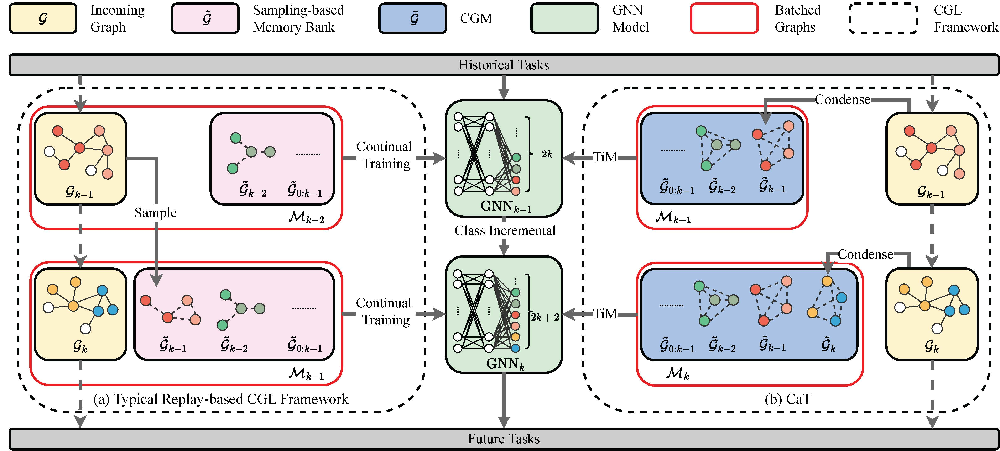
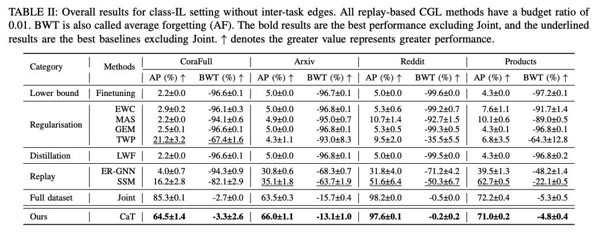

# CaT (Condense and Train)
This is the offical repository for the paper **CaT: Balanced Continual Graph Learning with Graph Condensation**

The following figure compares the typical replay-based CGL and CaT in the class incremental setting.


# Main experiment results.


# Experiment environment
Our experiments are run on the enviroment based on `Python 3.8` with the following packages:

```
pytorch==2.0.1
torch-geometric==2.3.1  # for deploying GNNs.
ogb==1.3.6  # for obtaining arxiv and prodcuts datasets.
progressbar2==4.2.0  # for visulasing the process of CGL
```

# Usage
To reproduce the results of Table 2 (classIL setting), please run the `table2.sh` in the `srcripts` folder:
```
run .\srcripts\table2.sh
```

# Cite
If you find this repo useful, please cite

```
@inproceedings{CaT,
  author    = {Yilun Liu and
               Ruihong Qiu and
               Zi Huang},
  title     = {CaT: Balanced Continual Graph Learning with Graph Condensation},
  journal   = {ICDM},
  year      = {2023}
}
```

# Credit
This repository was developed based on the [CGLB](https://github.com/QueuQ/CGLB).